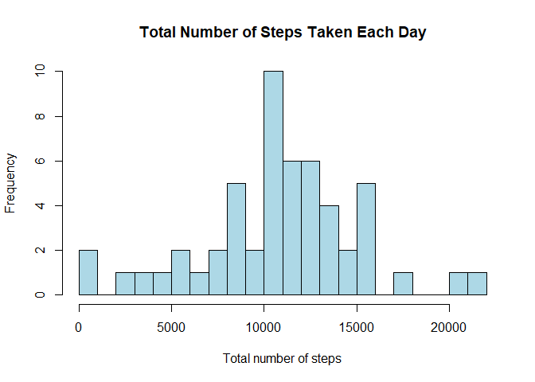
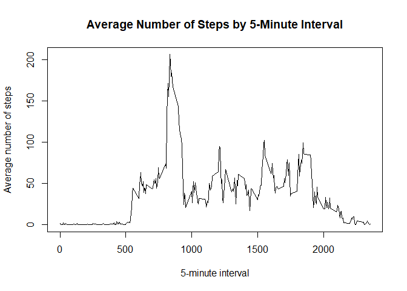
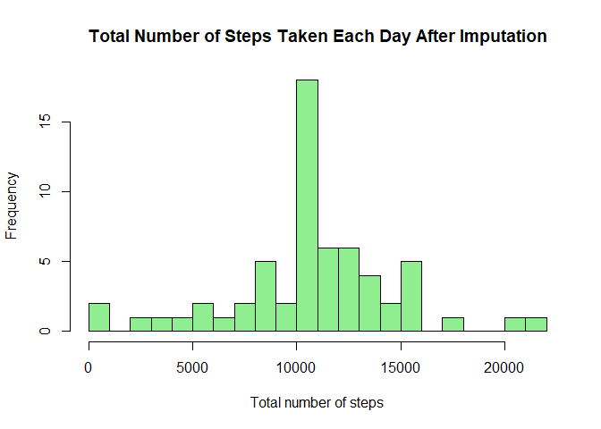
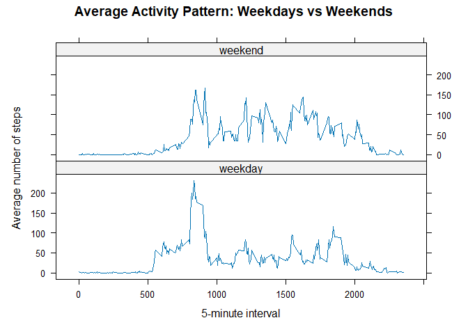

## Loading and preprocessing the data


``` r
knitr::opts_chunk$set(
  echo = TRUE,
  fig.path = "figure/"
)
```


``` r
activity <- read.csv(
  "activity.csv",
  header = TRUE,
  stringsAsFactors = FALSE
)

head(activity)
```

```
##   steps       date interval
## 1    NA 2012-10-01        0
## 2    NA 2012-10-01        5
## 3    NA 2012-10-01       10
## 4    NA 2012-10-01       15
## 5    NA 2012-10-01       20
## 6    NA 2012-10-01       25
```


## What is mean total number of steps taken per day?

``` r
daily_steps <- aggregate(
  steps ~ date,
  data = activity,
  FUN = sum,
  na.rm = TRUE
)


head(daily_steps)
```

```
##         date steps
## 1 2012-10-02   126
## 2 2012-10-03 11352
## 3 2012-10-04 12116
## 4 2012-10-05 13294
## 5 2012-10-06 15420
## 6 2012-10-07 11015
```


``` r
hist(
  daily_steps$steps,
  breaks = 20,
  col = "lightblue",
  main = "Total Number of Steps Taken Each Day",
  xlab = "Total number of steps",
  ylab = "Frequency"
)
```

<!-- -->


``` r
mean(daily_steps$steps)
```

```
## [1] 10766.19
```

``` r
median(daily_steps$steps)
```

```
## [1] 10765
```

## What is the average daily activity pattern?

``` r
interval_means <- aggregate(
  steps ~ interval,
  data = activity,
  FUN = mean,
  na.rm = TRUE
)
head(interval_means)
```

```
##   interval     steps
## 1        0 1.7169811
## 2        5 0.3396226
## 3       10 0.1320755
## 4       15 0.1509434
## 5       20 0.0754717
## 6       25 2.0943396
```


``` r
interval_steps <- aggregate(
  steps ~ interval,
  data = activity,
  FUN = mean,
  na.rm = TRUE
)
plot(
interval_steps$interval,
interval_steps$steps,
type = "l",
main = "Average Number of Steps by 5-Minute Interval",
xlab = "5-minute interval",
ylab = "Average number of steps"
)
```

<!-- -->


``` r
interval_steps[which.max(interval_steps$steps), ]
```

```
##     interval    steps
## 104      835 206.1698
```


## Imputing missing values

``` r
missing_values <- sum(is.na(activity$steps))


missing_values
```

```
## [1] 2304
```


``` r
interval_means <- aggregate(
  steps ~ interval,
  data = activity,
  FUN = mean,
  na.rm = TRUE
)


head(interval_means)
```

```
##   interval     steps
## 1        0 1.7169811
## 2        5 0.3396226
## 3       10 0.1320755
## 4       15 0.1509434
## 5       20 0.0754717
## 6       25 2.0943396
```


``` r
activity_imputed <- merge(
  activity,
  interval_means,
  by = "interval",
  all.x = TRUE
)
```


``` r
missing <- is.na(activity_imputed$steps)
activity_imputed$steps[missing] <-
activity_imputed$interval_mean[missing]
activity_imputed$interval_mean <- NULL
```


``` r
sum(is.na(activity_imputed$steps))
```

```
## [1] 0
```

``` r
head(activity_imputed)
```

```
##   interval steps.x       date  steps.y
## 1        0      NA 2012-10-01 1.716981
## 2        0       0 2012-11-23 1.716981
## 3        0       0 2012-10-28 1.716981
## 4        0       0 2012-11-06 1.716981
## 5        0       0 2012-11-24 1.716981
## 6        0       0 2012-11-15 1.716981
```


``` r
names(activity_imputed)
```

```
## [1] "interval" "steps.x"  "date"     "steps.y"
```


``` r
daily_steps_imputed <- aggregate(
  steps ~ date,
  data = activity,
  FUN = sum,
  na.rm = TRUE
)
head(daily_steps_imputed)
```

```
##         date steps
## 1 2012-10-02   126
## 2 2012-10-03 11352
## 3 2012-10-04 12116
## 4 2012-10-05 13294
## 5 2012-10-06 15420
## 6 2012-10-07 11015
```


``` r
interval_means <- aggregate(
  steps ~ interval,
  data = activity,
  FUN = mean,
  na.rm = TRUE
)
```


``` r
missing_values <- sum(is.na(activity$steps))
missing_values
```

```
## [1] 2304
```

``` r
interval_means <- aggregate(
  steps ~ interval,
  data = activity,
  FUN = mean,
  na.rm = TRUE
)

head(interval_means)
```

```
##   interval     steps
## 1        0 1.7169811
## 2        5 0.3396226
## 3       10 0.1320755
## 4       15 0.1509434
## 5       20 0.0754717
## 6       25 2.0943396
```

``` r
activity_imputed <- merge(
  activity,
  interval_means,
  by = "interval",
  all.x = TRUE
)

head(activity_imputed)
```

```
##   interval steps.x       date  steps.y
## 1        0      NA 2012-10-01 1.716981
## 2        0       0 2012-11-23 1.716981
## 3        0       0 2012-10-28 1.716981
## 4        0       0 2012-11-06 1.716981
## 5        0       0 2012-11-24 1.716981
## 6        0       0 2012-11-15 1.716981
```

``` r
missing <- is.na(activity_imputed$steps)
```
activity_imputed$steps[missing] <-
  activity_imputed$interval_mean[missing]

activity_imputed$interval_mean <- NULL


``` r
sum(is.na(activity_imputed$steps))
```

```
## [1] 0
```

``` r
names(activity)
```

```
## [1] "steps"    "date"     "interval"
```
head(daily_steps_imputed)


``` r
interval_means <- aggregate(
  steps ~ interval,
  data = activity,
  FUN = mean,
  na.rm = TRUE
)

head(interval_means)
```

```
##   interval     steps
## 1        0 1.7169811
## 2        5 0.3396226
## 3       10 0.1320755
## 4       15 0.1509434
## 5       20 0.0754717
## 6       25 2.0943396
```


``` r
activity_imputed <- merge(
  activity,
  interval_means,
  by = "interval",
  all.x = TRUE
)

head(activity_imputed)
```

```
##   interval steps.x       date  steps.y
## 1        0      NA 2012-10-01 1.716981
## 2        0       0 2012-11-23 1.716981
## 3        0       0 2012-10-28 1.716981
## 4        0       0 2012-11-06 1.716981
## 5        0       0 2012-11-24 1.716981
## 6        0       0 2012-11-15 1.716981
```


``` r
activity_imputed$steps.x[is.na(activity_imputed$steps.x)] <-
  activity_imputed$steps.y[is.na(activity_imputed$steps.x)]
```


``` r
activity_imputed$steps <- activity_imputed$steps.x
```
activity_imputed$steps.x <- NULL
activity_imputed$steps.y <- NULL


``` r
sum(is.na(activity_imputed$steps))
```

```
## [1] 0
```

``` r
daily_steps_imputed <- aggregate(
  steps ~ date,
  data = activity_imputed,
  FUN = sum
)
head(daily_steps_imputed)
```

```
##         date    steps
## 1 2012-10-01 10766.19
## 2 2012-10-02   126.00
## 3 2012-10-03 11352.00
## 4 2012-10-04 12116.00
## 5 2012-10-05 13294.00
## 6 2012-10-06 15420.00
```


``` r
hist(
  daily_steps_imputed$steps,
  breaks = 20,
  col = "lightgreen",
  main = "Total Number of Steps Taken Each Day After Imputation",
  xlab = "Total number of steps",
  ylab = "Frequency"
)
```

<!-- -->


``` r
mean(daily_steps_imputed$steps)
```

```
## [1] 10766.19
```

``` r
median(daily_steps_imputed$steps)
```

```
## [1] 10766.19
```

## Are there differences in activity patterns between weekdays and weekends?


``` r
activity_imputed$day_type <- ifelse(
  weekdays(as.Date(activity_imputed$date)) %in%
    c("Saturday", "Sunday"),
  "weekend",
  "weekday"
)
activity_imputed$day_type <- factor(
activity_imputed$day_type,
levels = c("weekday", "weekend")
)
head(activity_imputed)
```

```
##   interval  steps.x       date  steps.y    steps day_type
## 1        0 1.716981 2012-10-01 1.716981 1.716981  weekday
## 2        0 0.000000 2012-11-23 1.716981 0.000000  weekday
## 3        0 0.000000 2012-10-28 1.716981 0.000000  weekend
## 4        0 0.000000 2012-11-06 1.716981 0.000000  weekday
## 5        0 0.000000 2012-11-24 1.716981 0.000000  weekend
## 6        0 0.000000 2012-11-15 1.716981 0.000000  weekday
```

``` r
weekday_weekend <- aggregate(
  steps ~ interval + day_type,
  data = activity_imputed,
  FUN = mean
)
head(weekday_weekend)
```

```
##   interval day_type      steps
## 1        0  weekday 2.25115304
## 2        5  weekday 0.44528302
## 3       10  weekday 0.17316562
## 4       15  weekday 0.19790356
## 5       20  weekday 0.09895178
## 6       25  weekday 1.59035639
```

``` r
library(lattice)
xyplot(
steps ~ interval | day_type,
data = weekday_weekend,
type = "l",
layout = c(1, 2),
xlab = "5-minute interval",
ylab = "Average number of steps",
main = "Average Activity Pattern: Weekdays vs Weekends"
)
```

<!-- -->

``` r
data.frame(
  Measure = c("Mean", "Median"),
  Before_Imputation = c(
    mean(daily_steps$steps),
    median(daily_steps$steps)
  ),
  After_Imputation = c(
    mean(daily_steps_imputed$steps),
    median(daily_steps_imputed$steps)
  )
)
```

```
##   Measure Before_Imputation After_Imputation
## 1    Mean          10766.19         10766.19
## 2  Median          10765.00         10766.19
```

